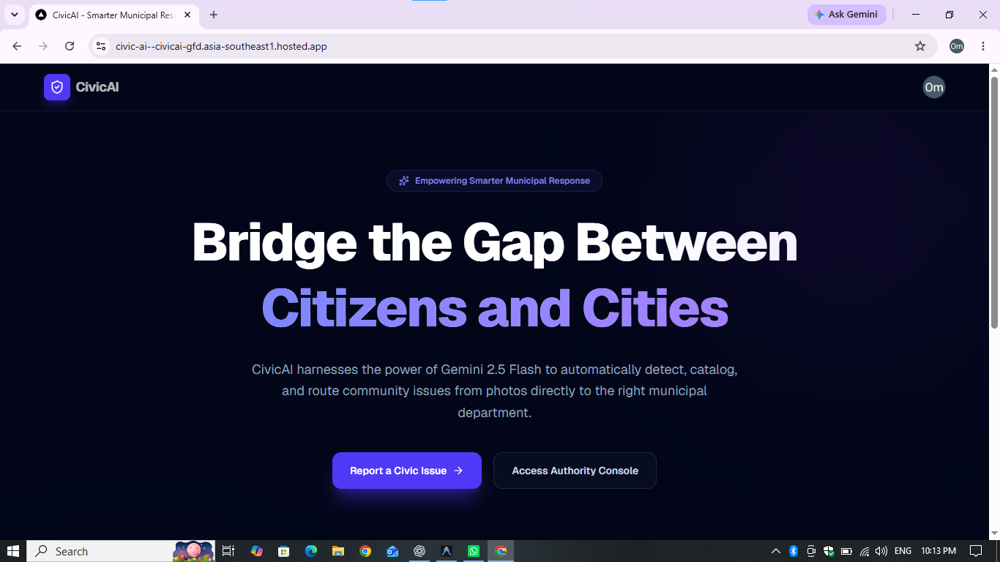
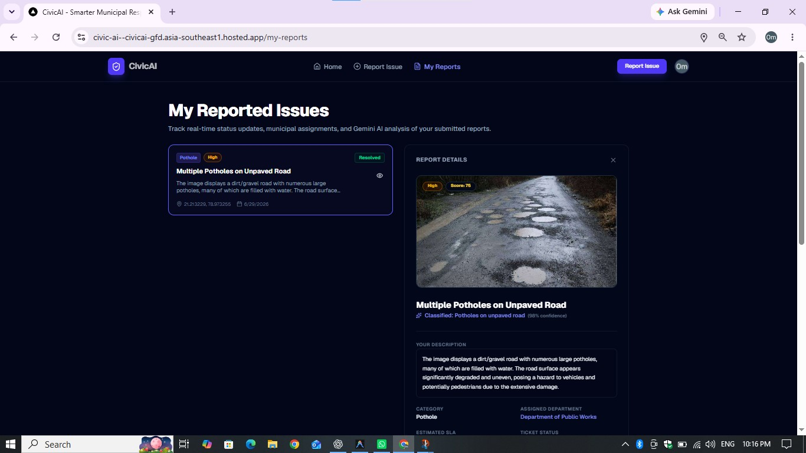
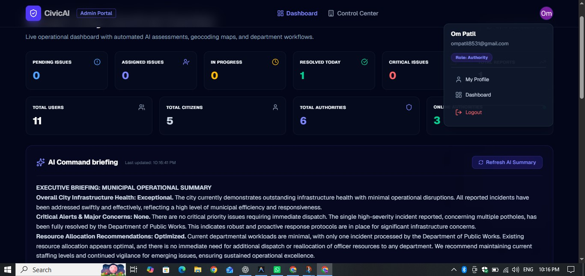
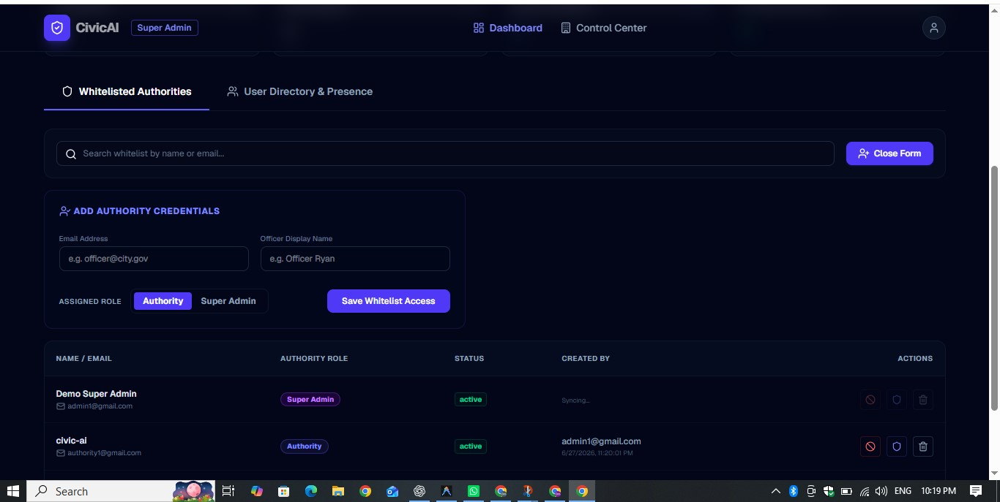

# 🚀 CivicAI – AI Powered Community Issue Reporting Platform

<p align="center">
  
  
  
  
  
</p>

## 📌 Overview

CivicAI is an AI-powered civic issue reporting platform that enables citizens to report public infrastructure problems such as potholes, garbage accumulation, water leakage, broken streetlights, and other civic issues.

Using Google's Gemini AI, the system automatically analyzes uploaded images, classifies the issue, determines its priority, and forwards it to the appropriate authorities. Citizens can track their reports in real time while authorities efficiently manage and resolve complaints through a dedicated dashboard.

---

# 🎯 Problem Statement

**Community Hero – Hyperlocal Problem Solver**

Build an AI-powered platform that enables citizens to identify, report, track and resolve community issues using intelligent automation and modern cloud technologies.

---

# ✨ Features

## 👤 Citizen Portal

- Secure Email Authentication
- Google Sign-In
- Report Civic Issues
- Upload Issue Images
- AI-powered Image Analysis
- Automatic Issue Categorization
- Smart Priority Detection
- Live Report Tracking
- My Reports Dashboard

---

## 🏛 Authority Dashboard

- View Reported Issues
- Filter Reports
- Update Issue Status
- Change Priority
- Resolve Complaints
- Live Dashboard

---

## 👨‍💼 Super Admin

- User Management
- Authority Management
- Audit Logs
- System Monitoring
- Administrative Dashboard

---

## 🤖 AI Features

- AI Image Analysis
- Automatic Issue Category Detection
- Smart Priority Prediction
- AI Generated Description
- Intelligent Report Processing

Powered by **Google Gemini AI**

---

# 🛠 Tech Stack

## Frontend

- Next.js 15
- React
- TypeScript
- Tailwind CSS

## Backend

- Firebase Authentication
- Cloud Firestore
- Firebase Storage

## Artificial Intelligence

- Google Gemini API

## Cloud Platform

- Firebase App Hosting
- Google Cloud

---

# 🏗 Architecture

```
Citizen
     │
     ▼
Next.js Frontend
     │
     ▼
Firebase Authentication
     │
     ▼
Cloud Firestore
     │
     ├────────► Firebase Storage
     │
     └────────► Gemini AI
                    │
                    ▼
Authority Dashboard
                    │
                    ▼
Super Admin Dashboard
```

---

# 🚀 Workflow

1. Citizen logs in.
2. Uploads an issue image.
3. Provides issue details.
4. Gemini AI analyzes the image.
5. AI predicts:
   - Issue Category
   - Priority
   - Description
6. Report is stored in Firestore.
7. Authority receives the report.
8. Authority updates the status.
9. Citizen tracks progress in real time.

---
# 📸 Screenshots

## Landing Page



---

## Report Issue



---

## Authority Dashboard



---

## Super Admin Dashboard


# 🌟 Key Highlights

- AI-powered Issue Detection
- Smart Priority Assignment
- Real-time Tracking
- Secure Authentication
- Role-based Access Control
- Modern Responsive UI
- Cloud Native Deployment

---

# 🔐 Authentication

- Email & Password Authentication
- Google Authentication
- Role-based Authorization

---

# ☁ Firebase Services Used

- Firebase Authentication
- Cloud Firestore
- Firebase Storage
- Firebase App Hosting

---

# 📂 Project Structure

```
app/
components/
lib/
providers/
public/
utils/
```

---

# ⚙ Installation

```bash
git clone https://github.com/ompatil0/Civic-Ai.git

cd Civic-Ai

npm install

npm run dev
```

---

# 🔑 Environment Variables

Create a `.env.local` file.

```env
NEXT_PUBLIC_FIREBASE_API_KEY=
NEXT_PUBLIC_FIREBASE_AUTH_DOMAIN=
NEXT_PUBLIC_FIREBASE_PROJECT_ID=
NEXT_PUBLIC_FIREBASE_STORAGE_BUCKET=
NEXT_PUBLIC_FIREBASE_MESSAGING_SENDER_ID=
NEXT_PUBLIC_FIREBASE_APP_ID=
NEXT_PUBLIC_FIREBASE_MEASUREMENT_ID=

NEXT_PUBLIC_GOOGLE_MAPS_API_KEY=

GEMINI_API_KEY=
```

---

# 🌍 Live Demo

**Website**

👉 https://civic-ai--civicai-gfd.asia-southeast1.hosted.app/
---

# 💻 GitHub Repository

https://github.com/ompatil0/Civic-Ai

---

# 🔮 Future Scope

- Community Voting
- Predictive Analytics
- Push Notifications
- Mobile Application
- IoT Sensor Integration
- Multilingual Support

---

# 👨‍💻 Developer

**Om Patil**

Computer Science Engineering Student

---

# 📜 License

This project is developed for educational and hackathon purposes.

---

## ⭐ If you like this project, don't forget to star the repository!